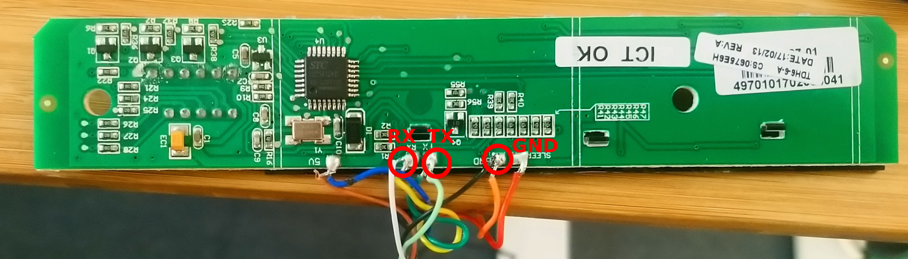
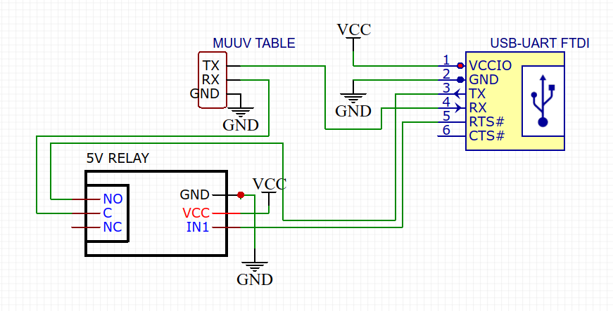

# muuvctl

Control muuv tables with an command line tool

## Wiring

### Basics

* Open the frontend controller
* Solder a 3-Pin cable to `RX`,`TX` and `GND`
* Connect `RX`,`TX` and `GND` to an USB-> UART controller



### Using controller while USB plugged in

The basic wiring has the disadvantage that only the UART-Controller can control the table and the muuv-device is disfunctional. It can be fixed with an relay connected to `RTS` line of the UART which breaks the `RX` line. It is important that the relay is high trigger.



## Installing

### System wide:
```
pip install .
```

### For current user:
```
pip install --user .
```
In order to run `muuvctl` from commandline, make sure that `/home/$USER/.local/bin` is in your `$PATH`

### Bash completion

Add the following to your  `.bashrc`:
```
complete -W "--debug --port get goto --follow" muuvctl
```

## Usage

Move the table to position 80:
```
muuvctl goto 80
```

Get current position of the table:
```
muuvctl get
```

Get live position of the table:
```
muuvctl get --follow
```


## Serial protocol

The protocol is not fully known.

The table sends the following for its position:
```
b'\x98'
b'\x98'
b'\x03' <- can be b'\x00' as well
b'\x03' <- can be b'\x00' as well
b'O' <- position ord(pos)
b'O' <- position ord(pos)
```

To move the table send the following:
```
b'f'  > 102
b'\x00' > 0 (no move) 1 (up) 2(down)
b'\x00' > 0 (no move) 1 (up) 2(down)
b'\xd8' > 216
b'\xd8' > 216
```
There is no known command yet to move the table to an specific position. You need to send up or down until the table reaches the desired position, then send stop.

## Contributing

Please let us know what you would like to contribute before you get invested! This is really a proof of concept at this stage.

### pre-commit hook

```bash
pip install pre-commit
pip install -r requirements-dev.txt -U
pre-commit install
```
